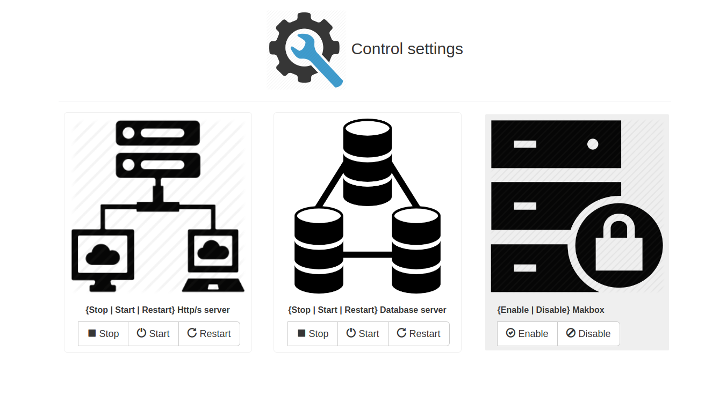

# control_settings
These are the control settings for makbox operations.

First open a terminal and type the sudo visudo command  
Then copy the following line and paste it into the visudo file.  

www-data ALL=(ALL) NOPASSWD: /etc/init.d/mysql stop, /etc/init.d/mysql start, etc/init.d/mysql restart,
                            /etc/init.d/apache2 stop, /etc/init.d/apache2 start, /etc/init.d/apache2 restart,
                           /bin/chmod -R 777 /var/www/makbox/, /bin/chmod -R 000 /var/www/makbox/

Save the file.  

Now open a browser and type  
https://localhost/control_settings or http://localhost/control_settings  
depending on your server.  
Now you can check the program functions.
 

    
